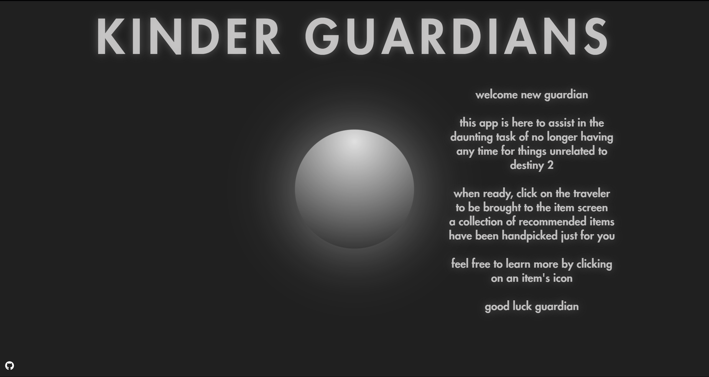
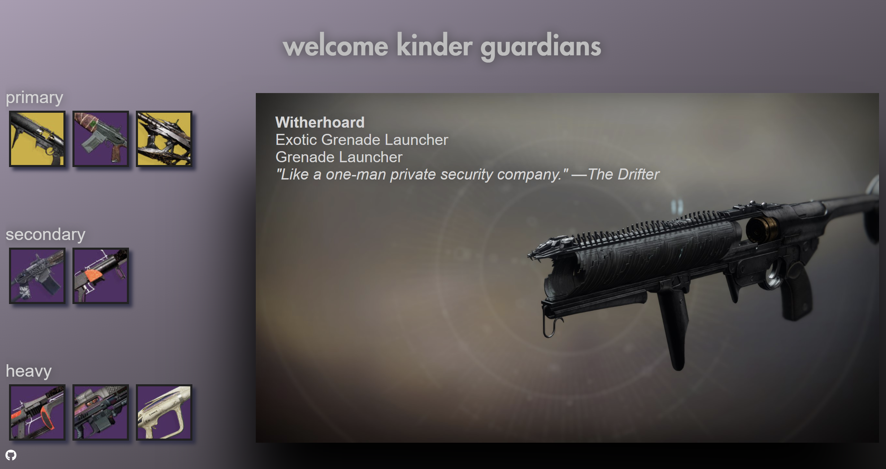
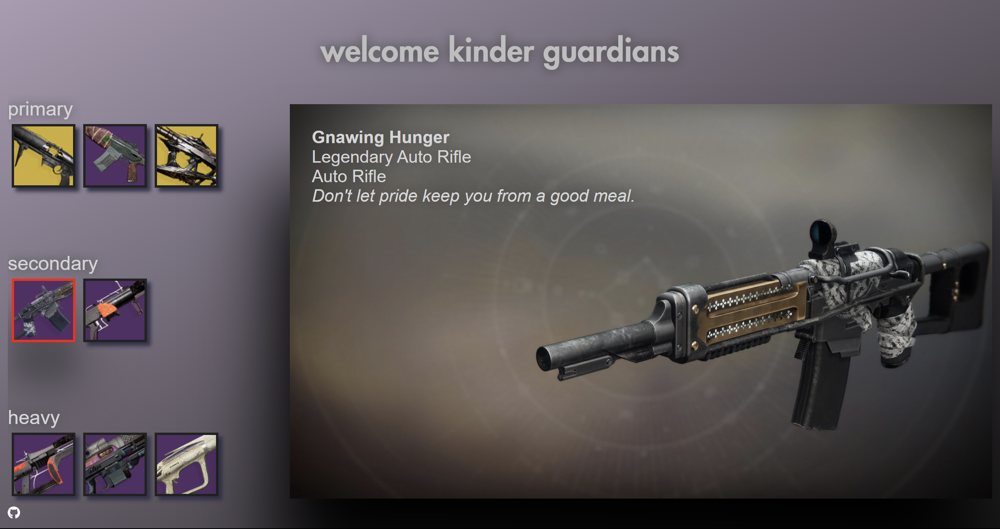
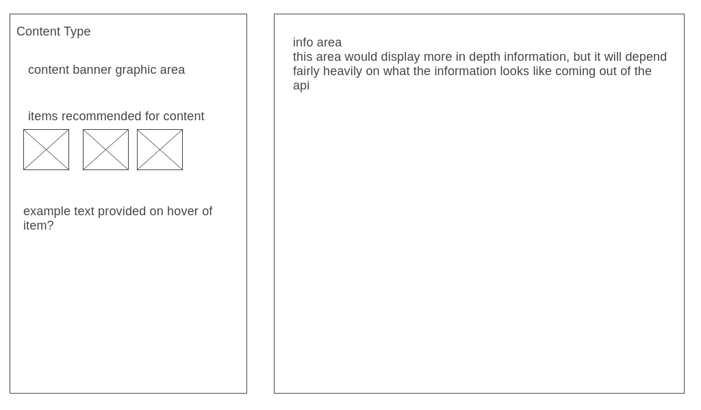

# [kinderGuardians](https://csmanel.github.io/kinderGuardians/)

this app is built as a helper for the game Destiny 2.
for those with no background, the game fuctions on multiple types of content that all require different gear or items. Often what is recommended is obscured by the sheer volume of things going on in the game. Kinder guardian displays selected items that are recommended for new players to get.

users will be able to select the item they are interested in which will cause a larger graphic of the item to display along with some basic information.

## Functionality



- Display interactive Traveler object
  - Object will give a small introduction when hovered over



```js
export default async function itemFetchAndDisplay(searchName) {
  fetch(MANIFESTURL, {
    headers: {
      'X-API-Key': APIKEY,
    },
  })
    .then((response) => response.json())
    .then((data) => {
      const manifest = data.Response;
      const inventoryUrl =
        manifest.jsonWorldComponentContentPaths.en
          .DestinyInventoryItemDefinition;

      fetch('https://www.bungie.net' + inventoryUrl, {
        headers: {
          'Accept-Encoding': 'gzip',
        },
      })
        .then((response) => response.json())
        .then((inventoryData) => {
          const codeItem = Object.values(inventoryData).filter(
            (item) => item.displayProperties.name === searchName
          );
          if (searchName) {
            let collectibleItem;
            codeItem.forEach((el) => {
              if ('collectibleHash' in el) {
                collectibleItem = el;
              }
            });
```

- This function does most of the heavy lifting, allowing information to be abstracted from the manifest within Bungie's api. From here we can search for particular items and later on take content out from those items to display them.



```js
const {
  displayProperties,
  flavorText,
  itemTypeAndTierDisplayName,
  itemTypeDisplayName,
  hash,
  screenshot,
  equippingBlock,
} = collectibleItem;
```

- From the abstracted manifest information we can deconstruct chosen information about each item.

### Future Inclusions

- Detailed graphs displaying more stats per item
- Ability to search for specific items rather than the list being chosen for the user
- Toggle switch so a user can either be displayed a generated list of items if they are new, or give them the ability to search

## Wireframes



- Content Type will display available content types a user can choose from, even if limited to one

  - each content will have a hover effect that displays a banner/small amount of information on the content

- Items displayed will be the items gotten from the api that are most popular for that current content

  - each item will feature a similar hover effect to the content type, providing some enlarged image of the item with a brief blurb of information

- Info area would change depending on what is clicked. If an item is clicked it will display info on that item as well how to best obtain that item

## APIs

- Bungie API for all information related to the game
- Webpack
- npm to manage project dependencies

## Implementation Timeline

- **Thursday:** Setup initial project, webpack/npm. Look into Bungie API for information that needs to actually be taken. How to access the popular items of the season, what that actually looks like when fetched, how to get graphics of items.

- **Friday & Weekend:** Dedicate to implenting actual logic. Make sure information associated with items are correct, and are correct for current season, as well as local storage to keep track of where user left off.Implement basic css.

- **Monday:** Begin working on more permanent styling. Add hover elements, get images/banners from API.

- **Tuesday:** Continue styling. Fix any existing bugs.

- **Wednesday:** Deploy to Github pages, adjust README as necessary.
